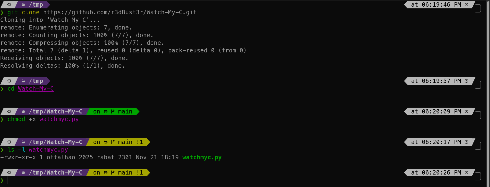
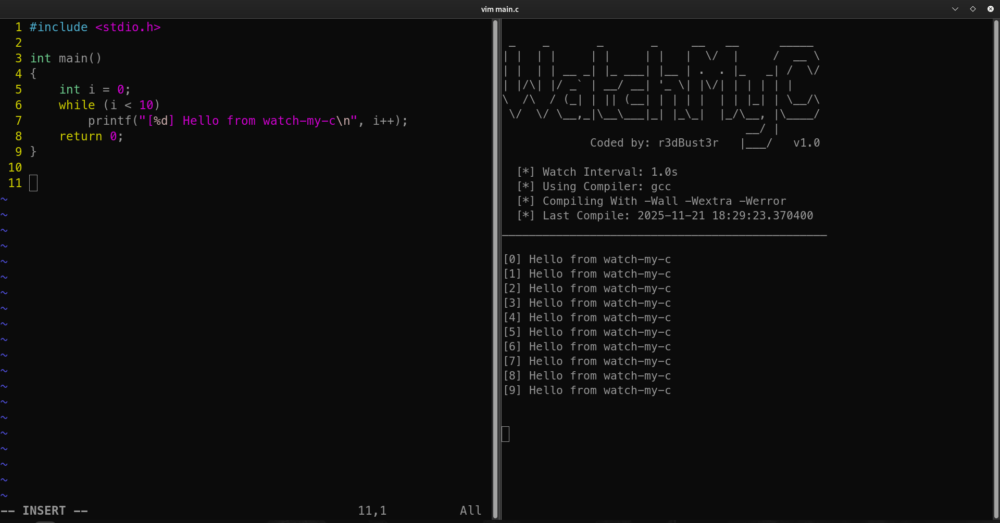

# Watch-My-C

**Auto-recompile your C program whenever the file changes, just save and it builds!**

Watch-My-C is a lightweight Python tool that monitors any C source file and recompiles it instantly whenever it’s modified. No need to manually rebuild, save your file and see output immediately.

Perfect for rapid prototyping, learning C, or debugging in real time.

---

## Features

- **Real-time file watching**: auto-recompiles on every save
- **Customizable compiler** (default: `cc`)
- **Optional warning flags** (`-Wall -Wextra -Werror`)
- **Configurable interval** between checks
- **Auto-execute the compiled binary**
- Clears screen before each build for clean output
- No dependencies beyond Python’s standard library

---

## Setup

### **Requirements**

* Python 3.x
* A C compiler (e.g., `cc`, `gcc`, `clang`)

### **Install**

Clone the project:

```bash
git clone https://github.com/r3dBust3r/Watch-My-C.git
cd Watch-My-C
```

Make the script executable:

```bash
chmod +x watchmyc.py
```



---

## Usage

### **Basic usage**

Watch `main.c` (default):

```bash
./watchmyc.py
# or
python3 watchmyc.py
```

### **Specify a file**

```bash
./watchmyc.py -p myfile.c
```

### **Use a specific compiler**

```bash
./watchmyc.py -c gcc
```

### **Enable warning flags (-Wall -Wextra -Werror)**

```bash
./watchmyc.py -f
```

### **Change the watch interval (in seconds)**

```bash
./watchmyc.py -i 1
```

### **Example: full command**

```bash
./watchmyc.py -p myfile.c -c gcc -f -i 1
```

---

## Command-line Flags

| Option | Long Form    | Description                    | Default  |
| ------ | ------------ | ------------------------------ | -------- |
| `-p`   | `--program`  | C file to watch                | `main.c` |
| `-c`   | `--compiler` | Which compiler to use          | `cc`     |
| `-f`   | `--flags`    | Enable `-Wall -Wextra -Werror` | off      |
| `-i`   | `--interval` | Check interval (seconds)       | `0.5`    |




---

## Stopping the Watcher

Press: `CTRL + C`

The script will exit gracefully.

---

## Contributing

Contributions are **open and highly welcome**!

To contribute:

1. **Fork** the repository
2. Create a branch:

   ```bash
   git checkout -b feature/new-idea
   ```
3. Commit your changes:

   ```bash
   git commit -m "Add new feature"
   ```
4. Push and submit a **Pull Request**

Feel free to open issues for suggestions or bugs.

